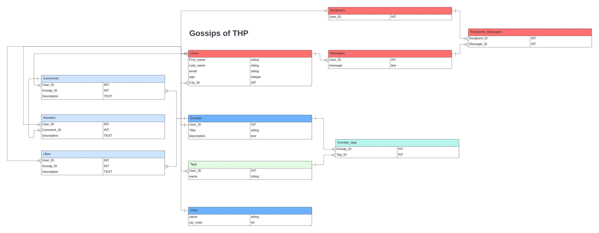

# BDD : The Gossip Project

## Overview

La base de données The Gossip Project permet de stocker les utilisateurs, gossips et les messages des utilisateurs.

## Get started

````sh
bundler install # installer les dépendances
rails console # teste la bdd
````

## arborescence de ce qui nous intéresse

````sh
/app
    /models
        /city.rb #model des villes des utilisateurs
        /gossip_tag.rb #model intermédiaire entre gossips et tags
        /gossip.rb #model des gossips
        /message.rb #model des messages privés entre utilisateurs
        /recipient_message.rb #model intermédiaire entre les destinataires et les messages
        /recipient.rb #model des destinataires reliés à la base de données des users
        /tag.rb #model des tags crées par les users
        /user.rb #model pour créer les utilisateurs
/db # Dossier contenant les migrations
    /migrate #toutes les migrations des différents models
    /seeds.rb #toutes les commandes pour vérifier et tester la bdd
````
## BDD Diagram

